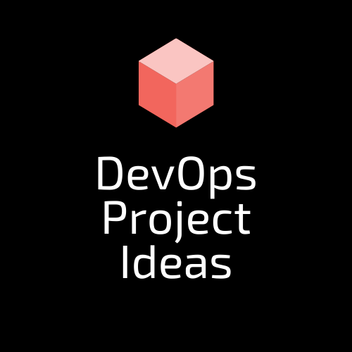

# DevOps Project Ideas

 

  

 

  
  

  

 

> A curated collection of realistic DevOps project ideas that you can start working on right away to improve your skills. I came up with this projects through real-world scenarios in larger organizations and checking out requirements in job ads

## Introduction

**DevOps Project Ideas** is a curated collection of DevOps project ideas based on real-world scenarios. DevOps teams may already be performing or will be required to accomplish these tasks.

Either you're transitioning into DevOps from a career as a developer or sysadmin, or you're looking to improve your DevOps skills for an entry-level position, you may be feeling exhausted by the huge amount of work ahead of you!. With basic knowledge of DevOps tools you can apply them to deploy software using this guide. These real-world projects are all focused on deploying software.

These projects cannot be completed using web consoles or point-and-click methods. You must use scripting and automation to tackle all of these issues. And besides, DevOps is built on the notion of automation. You can use your preferred automation tool such as PowerShell, Ansible, Bash, etc. and apply it to each project. Alternatively, if you're using a cloud provider, you can utilize their chosen automation tool if one is available. You should be able to pull down and destroy your infrastructure with whatever tools you choose, and then recreate it with automation.

### What you'll develop:

- Projects portfolio. Not bunch of certificates
- Not a 'paper engineer'. Be a real, practical engineer
- troubleshoot issues
- overcome knowledge barriers
- investigate new technologies
- projects you can highlight on your CV, resume, and GitHub profile

## Projects

Majority of these tasks will take several hours to perform. If you're new to DevOps, it could take hours or even days. When you're done, you'll have some code that you can push to a Git repository and share with prospective employers! Please don't give up. Everyone must begin somewhere. Best of luck!

<b>case study - deploy a static sites</b>
 

Imagine a startup called **risewise** build a landing page to showcase their services and they need a DevOps engineer to provision a web server with automation and publish a website onto it. In this case study, you will configure and serve a static HTML site using Nginx and install SSL/TLS certificate to load application over HTTPS.

To access the website, create a virtual server, install a web server on it, and configure networking and any necessary firewalls. You can try using web consoles to complete this task and after that use automation to provision a web server and publish a website onto it

### This project helps with these job requirements:

✅ Provision and configure infrastructure through automation.

✅ Knowledge of web application development, server deployment and maintenance, and general networking practices.

✅ Experience with scripting tools such as Bash, PowerShell, Batch e.t.c

✅ Web server security.

This project will also teach you how to use the command line to interact with a Linux or Windows server.

### Steps to take:

⏺ Set up a Git repository to save your work.

⏺ You can use any cloud provider to create (provision) a virtual machine.

⏺ Install Nginx on the virtual machine and configure Nginx to serve a static website.

⏺ Check that you can access the website using your web browser eg (https://example.com).

### Goals of the Project:

If you don't already have a solid understanding of server administration, this will help you get one. You'll have to learn things like: what is a web server? How do you install software using a package manager?

In addition, you'll need to learn how to use an automation tool and write your first automation code.

Useful resources:

- [What is a Web Server](https://nanduribalajee.medium.com/what-is-a-web-server-5c28c9391464)
- [SSL/TLS beginner’s tutorial](https://medium.com/talpor/ssl-tls-authentication-explained-86f00064280)

<b>case study - deploy a single page application</b>
 

**ngcruse** a fictitious company needs the help of a DevOps engineer to provision a web server with automation and publish a website onto it. In this case study, you will configure and serve a single page application (reactjs, vuejs or any spa will be fine) using Nginx and install SSL/TLS certificate to load application over HTTPS. You can use any available open source single page application for this task.

### This project helps with these job requirements:

✅ Knowledge of build tools.

### Steps to take:

⏺ Set up repository source code.

⏺ You can use any cloud provider to create (provision) a virtual machine.

⏺ Install Nginx on the virtual machine and configure Nginx to serve a static website.

⏺ DNS configuration

⏺ Check that you can access the website using your web browser eg (https://example.com).

### Goals of the Project:

You will learn more about Nginx as a web server and reverse proxy. You will also learn about build tools

Useful resources:

- [How To Deploy a React Application with Nginx on Ubuntu 20.04](https://www.digitalocean.com/community/tutorials/how-to-deploy-a-react-application-with-nginx-on-ubuntu-20-04)

<b>case study - deploy a full stack application</b>
 

In this case study, you will configure and serve a full stack application using any web server of your choice and install SSL/TLS certificate to load application over HTTPS. You can use any available open source full stack application (Nodejs/Reactjs, django/vuejs or any stack o your choice) for this task and Knowledge of any of these technologies is not required.

### This project helps with these job requirements:

✅ Troubleshooting techniques and fixing the code bugs.

✅ Configuration and managing databases such as MySQL, Mongo.

✅ Working knowledge of various tools, open-source technologies, and cloud services.

### Steps to take:

⏺ Set up repository source code.

⏺ You can use any cloud provider to create (provision) a virtual machine.

⏺ Install Nginx on the virtual machine and configure Nginx to serve a static website.

⏺ Database configuration and management

⏺ Configuring Nginx as a reverse proxy

⏺ DNS configuration

⏺ Check that you can access the frontend using your web browser which integrate with your backend eg (https://example.com).

### Goals of the Project:

This project will also teach you how to configure Nginx as a reverse proxy, how to integrate frontend and backend app. You will also learn how to configure and manage databases.

Useful resources:

- [Deploying Full Stack App onto Ubuntu/AWS: Postgres, Express, React, Node + SSL Let's Encrypt](https://www.youtube.com/watch?v=NjYsXuSBZ5U)

<b>case study - set up CI/CD pipeline for an application</b>
 

The primary goal of a CI/CD pipeline is to automate the software development lifecycle (SDLC). The pipeline will cover many aspects of a software development process, from writing the code and running tests to delivery and deployment. Simply stated, a CI/CD pipeline integrates automation and continuous monitoring into the development lifecycle.

In this case study yow will set up a pipeline, using one of the popular tools.

### This project helps with these job requirements:

✅ Develop, test, and maintain build and deployment scripts in CI/CD framework/tools to automate and streamline deployment processes.

This project will also teach you how to use the command line to interact with a Linux or Windows server.

### Steps to take:

⏺ Research and choose a CI/CD tool ( Jenkins, GitLab, GitHub Actions e.t.c). Choose a commonly used tool analyzing job ads will assist you in determining this and move with it. The most important thing is to gain experience and understand the terminology rather than memorize every command or feature.

⏺ Use any open source project on Github for this task and fork the project into your Github account.

⏺ Write a pipeline for your CI/CD tool, to test, compile & package the application. Run the pipeline in the CI/CD tool.

⏺ Extend the pipeline so that it can be deployed to a server. You'll need to do some research to figure out how the application is deployed.

⏺ Check the code for quality. Use Sonarqube or another open source or free tool to add a stage to your pipeline that checks code quality. (Optional)

⏺ Include a stage for manual approval. Add a stage to your pipeline that requires manual approval before going live.(Optional)

⏺ Create two pipelines to deploy an app with a separate frontend and backend.(Optional)

### Goals of the Project:

You'll learn about CI/CD concepts and gain hands-on experience configuring one tool and writing a pipeline.

Useful resources:

- [How to Build an Effective Initial Deployment Pipeline](https://www.toptal.com/devops/effective-ci-cd-deployment-pipeline)
- [Deploy your App Using CI/CD Pipeline](https://medium.com/wind-of-change/creating-a-ci-cd-pipeline-6ff9aeb0848c)
- [CI/CD Pipeline: A Gentle Introduction](https://semaphoreci.com/blog/cicd-pipeline)

